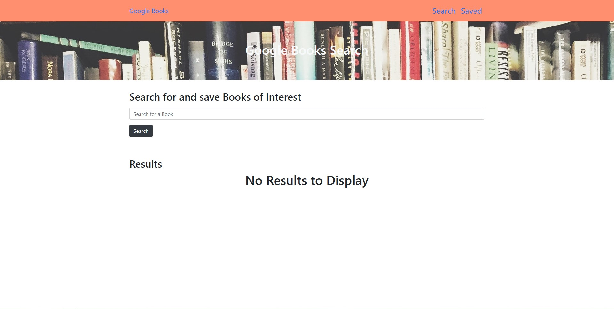
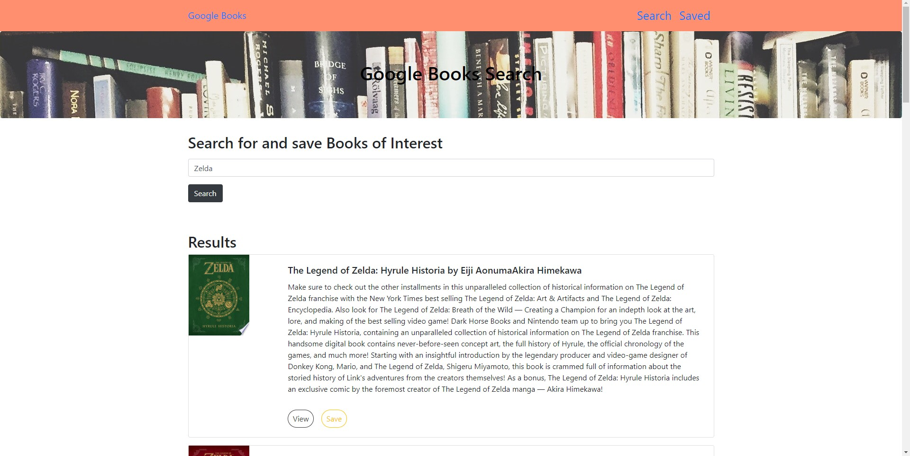
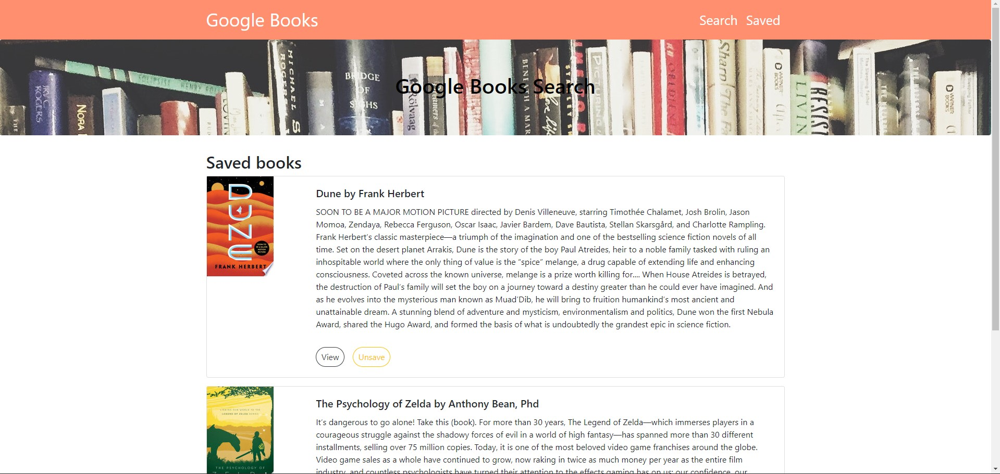

# Google_Book_Search

## Description
React-based Google Books Search app. This app displays books on user searches with an image, title, and description of the book searched. Users can save each book to review or purchase later.

## Table of Content

- [Installation](#installation)
- [Usage](#usage)
- [Author](#author)
- [Images](#images)
- [Demo](#demo)
- [Copyright](#copyright)

### Installation

No Installation required

### Usage

Once you visit the webpage you can search for any book within the Google API library. Once the book is searched the user can save or view the book for purchase from the google book store.

### Live Webapp

Try it out for yourself at [Google Book Search](https://afternoon-inlet-20487.herokuapp.com/)

### Licence

This project is licensed under the MIT- License

### Author

Zach Greenberg

### Images

### Demo

#### CopyRight

Copyright 2020 &copy; Zach Greenberg